# 面试问题大总结
- [1. 语言语法大类](#1-语言语法大类)
  - [1. const](#1-const)
  - [2. 虚函数](#2-虚函数)
  - [3. C++中什么函数不能被声明成虚函数](#3-c中什么函数不能被声明成虚函数)
  - [4. STL大总结](#4-stl大总结)
  - [5. 智能指针](#5-智能指针)
  - [6. 多继承问题，菱形继承](#6-多继承问题菱形继承)
  - [7. inline 和 宏 的区别](#7-inline-和-宏-的区别)
  - [8. 类型转换](#8-类型转换)
  - [9. 设计模式大总结](#9-设计模式大总结)
  - [10. malloc/free和new/delete的区别](#10-mallocfree和newdelete的区别)
  - [11. 类型大小/内存对齐](#11-类型大小内存对齐)
  - [12. 移动语义](#12-移动语义)
  - [13. 虚函数表](#13-虚函数表)
  - [14. Lambda表达式](#14-lambda表达式)
  - [15. 内存对齐](#15-内存对齐)
  - [16. 为什么使用虚析构](#16-为什么使用虚析构)
  - [17. 全局变量和静态全局变量](#17-全局变量和静态全局变量)
- [2. 408大类](#2-408大类)
  - [1. 排序算法](#1-排序算法)
  - [2. 0-1背包](#2-0-1背包)
  - [3. 解决hash冲突](#3-解决hash冲突)
  - [4. 线程安全](#4-线程安全)
  - [5. 堆栈型替换算法](#5-堆栈型替换算法)
  - [6. TCP/UDP](#6-tcpudp)
  - [7. 内存布局](#7-内存布局)
  - [8. 线程和进程的区别](#8-线程和进程的区别)
  - [9. 红黑树，AVL树，Hashmap比较](#9-红黑树avl树hashmap比较)
- [3. Leetcode算法大类](#3-leetcode算法大类)
  - [1. Fisher-Yates 洗牌算法 给定的数组乱序](#1-fisher-yates-洗牌算法-给定的数组乱序)
  - [2. Leetcode53 最大子数列之和](#2-leetcode53-最大子数列之和)
  - [3. 滑动窗口类型](#3-滑动窗口类型)
  - [4. 下一个更大排列](#4-下一个更大排列)
- [4. 图形学大类](#4-图形学大类)
  - [1. 图形渲染管线](#1-图形渲染管线)
  - [2. MVP变换](#2-mvp变换)
  - [3. A\*寻路算法](#3-a寻路算法)
- [5. 客户端工具大类](#5-客户端工具大类)
- [6. 数据库后端大类](#6-数据库后端大类)
  - [1. IO多路复用](#1-io多路复用)
  - [2. libevent](#2-libevent)
- [7. 其他大类](#7-其他大类)
  - [1. 处理循环依赖的核心思想是解耦，可以通过以下方式实现：](#1-处理循环依赖的核心思想是解耦可以通过以下方式实现)
  - [2. 遇到的最难解决的事](#2-遇到的最难解决的事)
  - [3. json, xml 和 protobuf 的对比](#3-json-xml-和-protobuf-的对比)
- [8. C#](#8-c)
  - [1. 值类型和引用类型](#1-值类型和引用类型)
  - [2. 拆箱装箱](#2-拆箱装箱)
  - [3. 协程](#3-协程)
  - [4. unity生命周期](#4-unity生命周期)
  - [5. 泛型](#5-泛型)
- [9.项目问题](#9项目问题)
  - [1. 游戏服务器](#1-游戏服务器)


## 1. 语言语法大类

### 1. const
| 声明形式         | 含义                         | 指针是否可变 | 内容是否可变 |
|------------------|------------------------------|--------------|--------------|
| `const char*`    | 指向常量字符的指针           | 可变         | 不可变       |
| `char* const`    | 常量指针，指向字符           | 不可变       | 可变         |
| `char const*`    | 指向常量字符的指针（同上）   | 可变         | 不可变       |

### 2. 虚函数
在C++中，虚函数（virtual function）主要用于实现多态性（Polymorphism）。通过虚函数，可以允许基类指针或引用指向派生类对象，并调用派生类中重写的（override）成员函数，从而实现运行时的动态绑定。
- 默认行为：

C++: 如果派生类定义了一个与基类成员函数签名相同但未使用 override 标记的方法，默认情况下这不会覆盖基类的方法，而是会隐藏它。这种行为可能导致意外错误。

C#: 如果派生类定义了与基类同名的方法但未使用 override 关键字，则必须显式地使用 new 关键字来隐藏基类的方法，否则编译器会给出警告或错误提示。这意味着 C# 更加严格地要求开发者明确其意图是覆盖还是隐藏基类方法。
- 析构函数：

C++: 支持虚析构函数，这对于确保通过基类指针删除派生类对象时正确释放资源非常重要。如果基类析构函数不是虚函数，可能会导致派生类的析构函数不被调用，从而引发资源泄漏问题。

C#: 析构函数（终结器）是隐式的非虚函数，且不能显式声明为虚函数。C# 推荐使用 IDisposable 接口和 Dispose 方法来进行资源管理，而非依赖析构函数。
- 抽象方法和类：

C++: 没有专门的关键字来表示抽象方法或抽象类。通常的做法是将纯虚函数（= 0）放在基类中以模拟抽象方法，并通过包含至少一个纯虚函数来使类成为抽象类。

C#: 明确支持抽象类（使用 abstract 关键字）和抽象方法（同样使用 abstract）。抽象类不能实例化，抽象方法没有实现，必须由派生类提供具体实现。

**虚表指针什么时候产生**
编译时虚表产生：当编译器遇到虚函数，就会为该类生成一个虚函数表（vtable），表中存储了虚函数的地址
运行对象实例化时生成：当对象实例化时，编译器会为该对象分配内存，并初始化该对象的虚表指针（构造函数）。


### 3. C++中什么函数不能被声明成虚函数

构造函数：因为虚函数表在构造函数执行时尚未完全构建

内联函数：因为虚函数的调用依赖于运行时绑定，而内联函数的目标是编译时展开

静态成员函数：因为它们不属于具体对象，且没有 this 指针。

友元函数：因为它们不是类的成员函数。

### 4. STL大总结
||Vector |Deque|List|Set|MultiSet|Map|MultiMap
|-|-|-|-|-|-|-|-|
内部结构|dynamic array|array of arrays|double linked list|binary tree|binary tree|binary tree|binary tree|
随机存取|Yes|Yes|No|No|No|Yes(key)|No
搜索速度|慢|慢|很慢|快|快|快|快
快速插入移除|尾部|首尾|任何位置|--|--|--|--
#### 1. vector和list的区别
vector：基于动态数组实现。这意味着所有元素存储在一块连续的内存空间中。支持随机访问，在末尾插入/删除元素效率较高，但如果需要调整容量（即扩容），则可能涉及大量的内存复制操作。由于是连续存储，因此对内存的要求较为紧凑，但是当需要增加容量时可能会导致重新分配内存，并且旧的数据也需要被复制到新的位置

list：基于双向链表实现。每个元素（节点）包含指向前一个元素和后一个元素的指针。插入/删除操作非常高效。

#### 2. map
在 C++ 的标准模板库（STL）中，map 是一种非常重要的关联容器。它用于存储键值对（key-value pairs），并且保证键的唯一性。map 的底层通常基于平衡二叉搜索树（如红黑树）实现，因此它具有有序性和高效的查找性能。

**键是唯一的**map 中的每个元素是一个键值对（std::pair<const Key, Value>），其中键是唯一的，值可以重复。键（Key）用于索引，值（Value）则是与键相关联的数据。

**自动排序**：map 中的元素按照键的顺序进行排序，默认情况下使用 < 运算符进行比较。如果需要自定义排序规则，可以通过提供一个比较函数或仿函数来实现。

**时间复杂度**:插入、删除和查找操作的时间复杂度为 O(log n)，因为底层使用了平衡二叉树。

**map**：
基于红黑树（一种平衡二叉搜索树）实现。当你需要按键排序时。
当你需要频繁进行范围查询或有序遍历时。
*优点*：元素有序，支持范围查询。
*缺点*：插入和查找的时间复杂度为 O(log n)，比哈希表稍慢。

**multimap**：允许键重复，其他特性与 map 类似。

**unordered_map**：基于哈希表实现，不保证元素的顺序。查找、插入和删除操作的时间复杂度为 O(1)（平均情况下）。
*优点*：插入和查找的时间复杂度为 O(1)（平均情况下）。
*缺点*：元素无序，可能会发生哈希冲突。

而C++ STL 标准库中，不仅是 unordered_map 容器，**所有无序容器的底层实现都采用的是哈希表存储结构**。更准确地说，是用“**链地址法**”（又称“开链法”）解决数据存储位置发生冲突的哈希表。

||效率/空间占用 (大)	| 效率/空间占用 (中)| 效率/空间占用 (小)|
|---------------|------------------|-------------|------------|
|Find & Insert	|unordered_map	|hash_map	|map|
|Space	|map	|unordered_map	|hash_map|

*注意*
- 键的唯一性：map 中的键必须是唯一的，而 multimap 允许键重复。
- 性能问题：如果数据量较大且对性能要求较高，优先考虑 unordered_map。
- 线程安全：map 和 unordered_map 都不是线程安全的，多线程环境下需要额外加锁。

#### 3. vector

1. 内存布局
vector 的底层使用一块连续的内存区域来存储元素。这种连续性使得vector 支持高效的随机访问（时间复杂度为 O(1)）。其内存布局主要包括以下部分：

```Cpp
template <typename T>
class vector {
private:
    T* buffer;       // 指向一块动态分配的连续内存区域，用于存储实际的元素
    size_t _size;    // 当前存储的元素个数
    size_t _capacity; // 当前分配的缓冲区大小，表示在不重新分配内存的情况下可以容纳的最大元素数量
};
```
2. 动态扩容机制
当向 std::vector 添加元素时，如果当前的 _size 达到了 _capacity，std::vector 会触发动态扩容操作。扩容的过程如下：

   *分配新内存*：新的容量通常是当前容量的两倍,分配一块更大的连续内存区域。

   *拷贝/移动旧数据*：将旧缓冲区中的元素逐个拷贝或移动到新的内存区域。
如果元素类型支持移动语义，则优先使用移动构造函数以提高效率。

   *释放旧内存*：删除旧缓冲区，避免内存泄漏。

   *更新指针和容量*：更新 buffer 指向新的内存区域，并更新 _capacity 和 _size。
3. 常见操作的实现细节

   1.*随机访问*
```Cpp
T& operator[](size_t index) {
    return buffer[index];  //随机访问的时间复杂度为 O(1)。
}
```
   2. *插入元素*: 在尾部插入元素时（push_back），如果未达到容量限制，则直接在尾部添加元素；否则触发扩容。
在中间插入元素时（insert），需要将插入点之后的所有元素向后移动一位，时间复杂度为 O(n)。
   3. *删除元素*: 删除尾部元素（pop_back）非常高效，只需减少 _size，时间复杂度为 O(1)。
删除中间元素（erase）需要将删除点之后的所有元素向前移动一位，时间复杂度为 O(n)。
   4. *清空容器*: 调用 clear() 时，_size 被设置为 0，但缓冲区不会被释放。缓冲区仍然保留，以便后续使用。

4. 性能优化策略
为了提高性能，std::vector 实现了以下优化策略：

   1. 预留容量
通过 reserve(size_t n) 方法，可以提前分配足够的容量，避免频繁的扩容操作。

   2. 移动语义
C++11 引入了移动语义，允许在扩容或其他涉及对象转移的操作中使用移动构造函数，而不是深拷贝。这显著提高了性能，特别是对于复杂类型（如 std::string 或自定义类）。

   3. 小型缓冲区优化（SSO）
某些 STL 实现对小型对象进行了优化，例如 std::string 可能会在栈上分配一个小缓冲区，而不需要立即分配堆内存。类似地，std::vector 也可能对少量元素采用类似的优化策略。

**emplace_back() 函数**

emplace_back() 函数在原理上比 push_back() 有了一定的改进，包括在内存优化方面和运行效率方面。内存优化主要体现在使用了就地构造（直接在容器内构造对象，不用拷贝一个复制品再使用）+强制类型转换的方法来实现，在运行效率方面，由于省去了拷贝构造过程，因此也有一定的提升。

### 5. 智能指针

#### unique_ptr：
独占式指针，与所指对象的内存绑定紧密，禁止其他智能指针与其他共享同一个对象。也就是同一时间只能有一个智能指针可以指向该对象

独占的意思是不可以复制(拷贝构造和拷贝复制)，但是我们可以利用std::move将其转移给其他unique_ptr(可以移动构造和移动赋值)。一旦转移，这个所有权就会失去，除非被显示归还

从实现上来讲，unique_ptr是一个**删除了拷贝构造函数**，**保留了移动构造函数**的指针类型。可以使用右值对unique_ptr进行构造
#### shared_ptr：
实现了共享式拥有的概念，即多个智能指针可以指向相同的对象，该对象以及相关资源会在其所指对象不再使用之后，自动释放与对象相关的资源

它是使用计数机制来表明资源被几个指针共享
可以通过**成员函数 use_count()** 来查看资源的所有者个数，除了可以通过 new 来构造，还可以通过传⼊auto_ptr,unique_ptr,weak_ptr 来构造。当我们调⽤ **release()** 时，当前指针会释放资源所有权，计数减⼀。当计数等于 0时，资源会被释放。

shared_ptr 是为了解决 auto_ptr 在对象所有权上的局限性 (auto_ptr 是独占的)，在使⽤**引⽤计数**的机制上提供了可以共享所有权的智能指针。

因为使用shard_ptr仍然需要new来调用，这使得代码出现了不对称，std::make_shared_ptr就可以显示消除这个new

#### weak_ptr
解决shared_ptr相互引用的问题，两个指针的引用计数永远不会下降为0，从而导致死锁问题。而weak_ptr是对对象的一种弱引用，可以绑定到shared_ptr，但不会增加对象的引用计数。

weak_ptr是为了配合shared_ptr而引入的一种智能指针，它更像是shared_ptr的一个助手而不是智能智能，因为它没有普通指针的行为，没有重置*和→。它得最大作用是协助shared_ptr工作，像是旁观者那样观测资源的使用情况

weak_ptr是一种**不控制对象生命周期**的智能指针，它指向一个shared_ptr管理的对象。进行该对象的内存管理的是那个强引用的shared_ptr

weak_ptr只是提供了对管理对象的一个访问手段。weak_ptr设计的目的是为了配合shared_ptr而引入的一种智能指针来协助shared_ptr工作，它只可以从一个 shared_ptr 或另⼀个 weak_ptr 对象构造,，它的**构造和析构不会引起引用计数的增加或者减少**

weak_ptr 是⽤来解决 shared_ptr 相互引⽤时的死锁问题，如果说两个 shared_ptr 相互引⽤，那么这两个指针的引⽤计数永远不可能下降为0，也就是资源永远不会释放。它是对对象的⼀种**弱引⽤，不会增加对象的引⽤计数**，和shared_ptr 之间可以相互转化，shared_ptr 可以直接赋值给它，它可以通过**调⽤ lock 函数**来获得shared_ptr。

当两个智能指针都是 shared_ptr 类型的时候，析构时两个资源引⽤计数会减⼀，但是两者引⽤计数还是为 1，导致跳出函数时资源没有被释放（的析构函数没有被调⽤），解决办法：**把其中⼀个改为weak_ptr就可以**。

weak_ptr可以从一个shared_ptr和另一个weak_ptr对象构造，它是一种弱引用（shared_ptr是一种强引用），弱引用不会引起引用计数的增加，它提供了一个expired()方法用来判断当前weak_ptr是否为空或者执行的堆内存是否已经被释放了。提供了一个lock()，如果当前weak_ptr已经过期，那么就会返回一个空的shared_ptr指针，否则，会返回实际的shared_ptr指针

#### 手动实现智能指针(shared_ptr)
```cpp
#include <iostream>

template<typename T>
class SharedPtr {
private:
    T* ptr;  // 指向实际对象的指针
    int* count;  // 用于计数引用该对象的智能指针数量

public:
    // 构造函数
    explicit SharedPtr(T* p = nullptr) : ptr(p), count(new int(1)) {
        if (ptr) {
            *count = 1;
        } else {
            *count = 0;
        }
    }

    // 拷贝构造函数
    SharedPtr(const SharedPtr& other) : ptr(other.ptr), count(other.count) {
        if (ptr) {
            ++(*count);
        }
    }

    // 移动构造函数
    SharedPtr(SharedPtr&& other) noexcept : ptr(other.ptr), count(other.count) {
        other.ptr = nullptr;
        other.count = nullptr;
    }

    // 赋值操作符
    SharedPtr& operator=(const SharedPtr& other) {
        if (this != &other) {
            release();
            ptr = other.ptr;
            count = other.count;
            if (ptr) {
                ++(*count);
            }
        }
        return *this;
    }

    // 移动赋值操作符
    SharedPtr& operator=(SharedPtr&& other) noexcept {
        if (this != &other) {
            release();
            ptr = other.ptr;
            count = other.count;
            other.ptr = nullptr;
            other.count = nullptr;
        }
        return *this;
    }

    // 解引用操作符
    T& operator*() const {
        return *ptr;
    }

    // 成员访问操作符
    T* operator->() const {
        return ptr;
    }

    // 析构函数
    ~SharedPtr() {
        release();
    }

private:
    void release() {
        if (ptr) {
            --(*count);
            if (*count == 0) {
                delete ptr;
                delete count;
            }
            ptr = nullptr;
            count = nullptr;
        }
    }
};

// 测试代码
class Test {
public:
    Test() { std::cout << "Test created\n"; }
    ~Test() { std::cout << "Test destroyed\n"; }
    void greet() { std::cout << "Hello from Test!\n"; }
};

int main() {
    SharedPtr<Test> sp1(new Test());
    sp1->greet();

    {
        SharedPtr<Test> sp2 = sp1;
        sp2->greet();
    } // sp2 goes out of scope, should not destroy the object

    sp1->greet(); // Should still work

    return 0;
}
```

#### 智能指针使用场景

1、unique_ptr独占对象的所有权，由于没有引用计数，因此性能较好

2、shared_ptr共享对象的所有权，但性能略差

3、weak_ptr配合shared_ptr，解决循环引用的问题

由于性能问题，那么可以粗暴的理解：优先使用unique_ptr。但由于unique_ptr不能进行复制，因此部分场景下不能使用的。

**unique_ptr 的使用场景**

unique_ptr一般在不需要多个指向同一个对象的指针时使用。但这个条件本身就很难判断，在我看来可以简单的理解：这个对象在对象或方法内部使用时优先使用unique_ptr。

1、对象内部使用
```cpp
class TestUnique
{
private:
    std::unique_ptr<A> a_ = std::unique_ptr<A>(new A());
public:
    void process1()
    {
        a_->do_something();
    }

    void process2()
    {
        a_->do_something();
    }

    ~TestUnique()
    {
        //此处不再需要手动删除a_
    }
};
```
2、方法内部使用
```cpp
void test_unique_ptr()
{
    std::unique_ptr<A> a(new A());
    a->do_something();
}
```
**shared_ptr 的使用场景及最佳实践**

shared_ptr一般在需要多个执行同一个对象的指针使用。在我看来可以简单的理解：这个对象需要被多个 Class 同时使用的时候。
```cpp
class B
{
private:
    std::shared_ptr<A> a_;

public:
    B(std::shared_ptr<A>& a): a_(a) {}
};

class C
{
private:
    std::shared_ptr<A> a_;

public:
    C(std::shared_ptr<A>& a): a_(a) {}
};

std::shared_ptr<B> b_;
std::shared_ptr<C> c_;

void test_A_B_C()
{
    std::shared_ptr<A> a = std::make_shared<A>();
    b_ = std::make_shared<B>(a);
    c_ = std::make_shared<C>(a);
}
```
在上面的代码中需要注意，我们使用std::make_shared代替new的方式创建shared_ptr。

因为使用new的方式创建shared_ptr会导致出现两次内存申请，而std::make_shared在内部实现时只会申请一个内存。因此建议后续均使用std::make_shared。

如果A想要调用B和C的方法怎么办呢？可否在A中定义B和C的shared_ptr呢？答案是不可以，这样会产生循环引用，导致内存泄露。

此时就需要weak_ptr出场了。

### 6. 多继承问题，菱形继承

**1. 多继承的实现**

**内存布局**
多继承的实现通常通过以下方式：
1. **基类子对象的存储**：派生类对象中包含所有基类的子对象。
   - 如果 `Base1` 和 `Base2` 各自有一个虚函数表，则 `Derived` 对象会包含两个虚表指针（vptr），分别指向 `Base1` 和 `Base2` 的虚函数表。
2. **偏移量调整**：当通过基类指针访问派生类对象时，编译器可能需要调整指针的偏移量以正确访问基类子对象。

**2. 可能出现的问题**

**(1) 二义性问题**
当两个基类中有同名的成员（变量或函数）时，派生类无法直接区分它们，导致二义性错误。

**解决方案**

使用作用域解析运算符明确指定调用哪个基类的成员：
  ```cpp
  d.Base1::func(); // 调用 Base1 的 func()
  d.Base2::func(); // 调用 Base2 的 func()
  ```
在派生类中重新定义该成员以消除二义性。

**(2) 菱形继承问题**

菱形继承是指一个派生类从两个基类继承，而这两个基类又共同继承自同一个基类。这会导致基类被多次实例化，从而浪费资源并引发二义性问题。

**解决方案**

使用 **虚继承**（virtual inheritance）来解决菱形继承问题：
虚继承确保 `Base` 只被实例化一次，所有路径共享同一个 `Base` 子对象。

**(3) 指针转换问题**

在多继承中，基类指针和派生类指针之间的转换可能会涉及指针偏移调整。

**(4) 构造和析构顺序问题**

在多继承中，构造函数和析构函数的调用顺序可能会影响程序的行为。
构造顺序：按照基类声明的顺序依次调用基类的构造函数，然后调用派生类的构造函数。
析构顺序：与构造顺序相反。

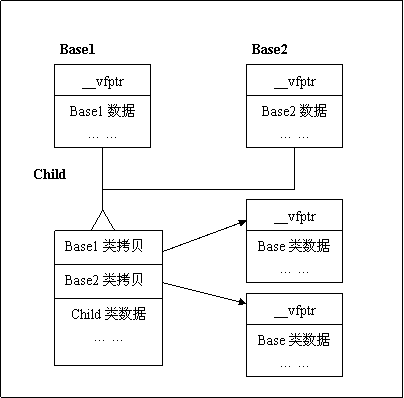

先是基类的虚函数指针，成员变量等，然后再是子类的

### 7. inline 和 宏 的区别
**宏**：宏是在预处理阶段进行文本替换的。这意味着宏定义中的参数不会进行类型检查，并且如果宏体设计不当，可能会导致意外的行为。

**Inline函数**：inline函数是在编译阶段处理的。这允许编译器对传入的参数进行类型检查，并且可以提供更好的调试信息。
### 8. 类型转换

#### dynamic_cast
**dynamic_cast**是四个强制类型转换操作符中最特殊的一个，它支持运行时识别指针或引用。

首先，dynamic_cast依赖于RTTI信息，其次，在转换时，dynamic_cast会检查转换的source对象是否真的可以转换成target类型，这种检查不是语法上的，而是真实情况的检查是 C++ 中的一个类型转换运算符，用于在运行时进行动态类型转换。
dynamic_cast用于**类继承层次间的指针或引用转换**。主要还是用于执行“安全的向下转型（safe downcasting）”，也即是基类对象的指针或引用转换为同一继承层次的其他指针或引用

#### static_cast

#### reinterpret_cast
#### const_cast

### 9. 设计模式大总结

#### 1. 单例模式（Singleton）
描述：确保一个类仅有一个实例，并提供一个全局访问点。

应用场景：管理游戏配置（如音量、分辨率）、游戏状态管理器、日志记录等。
#### 2. 工厂方法模式（Factory Method）
描述：定义一个用于创建对象的接口，但让子类决定实例化哪一个类。

应用场景：创建不同类型的敌人、物品或角色；根据玩家的选择生成不同的游戏地图或关卡。
#### 3. 抽象工厂模式（Abstract Factory）
描述：提供一个创建一系列相关或相互依赖对象的接口，而无需指定它们具体的类。

应用场景：为不同平台或游戏风格（例如科幻、幻想）提供统一的UI组件集合。
#### 4. 观察者模式（Observer）
描述：定义对象间的一种一对多的依赖关系，当一个对象的状态发生改变时，所有依赖于它的对象都会得到通知并自动更新。

应用场景：实现事件系统，比如当游戏角色的生命值变化时，通知相关的UI元素进行更新。

### 10. malloc/free和new/delete的区别
|特性|	malloc|	new|
|----|----|----|
|用途	|动态分配内存|	动态分配内存并初始化|
|返回类型|	void*|	对象类型的指针|
|初始化|	不初始化	|调用构造函数初始化|
|错误处理| 返回 NULL|	抛出 std::bad_alloc|
|数组分配|	需要手动计算大小|	支持直接分配数组|
|释放内存|	使用 free()	|使用 delete 或 delete[]|

**malloc/free 和 new/delete的区别**

- malloc和free是函数，new和delete是操作符

- malloc申请的空间不会初始化，new可以初始化

- malloc申请空间时需要手动计算空间大小并传递，new不需要

- malloc的返回值为void*，使用时必须强转来接收，new不需要

- malloc申请失败时返回NULL，new申请失败会抛异常

- 申请自定义类型的对象时，malloc/free不会调用构造函数和析构函数，而new会申请空间后调用构造函数，delete会调用析构函数后再释放空间。
  
**malloc 底层实现**

1）当开辟的空间小于 128K 时，调用 brk（）函数，malloc 的底层实现是系统调用函数 brk（），其主要移动指针 _enddata(此时的 _enddata 指的是 Linux 地址空间中堆段的末尾地址，不是数据段的末尾地址)

2）当开辟的空间大于 128K 时，mmap（）系统调用函数来在虚拟地址空间中（堆和栈中间，称为“文件映射区域”的地方）找一块空间来开辟。

### 11. 类型大小/内存对齐

- **平台原因(移植原因)**：不是所有的硬件平台都能访问任意地址上的任意数据的；某些硬件平台只能在某些地址处取某些特定类型的数据，否则抛出硬件异常。
  
- **性能原因**：数据结构(尤其是栈)应该尽可能地在自然边界上对齐。原因在于，为了访问未对齐的内存，处理器需要作两次内存访问；而对齐的内存访问仅需要一次访问。
假如没有内存对齐机制，数据可以任意存放，现在一个int变量存放在从地址1开始的联系四个字节地址中，该处理器去取数据时，要先从0地址开始读取第一个4字节块,剔除不想要的字节（0地址）,然后从地址4开始读取下一个4字节块,同样剔除不要的数据（5，6，7地址）,最后留下的两块数据合并放入寄存器。这需要做很多工作。
现在有了内存对齐的，int类型数据只能存放在按照对齐规则的内存中，比如说0地址开始的内存。那么现在该处理器在取数据时一次性就能将数据读出来了，而且不需要做额外的操作，提高了效率。

### 12. 移动语义
引入右值引用的主要目的是提高程序运行的效率。当类持有其它资源时，例如动态分配的内存、指向其他数据的指针等，拷贝构造函数中需要以深拷贝（而非浅拷贝）的方式复制对象的所有数据。深拷贝往往非常耗时，合理使用右值引用可以避免没有必要的深拷贝操作。

这里引入了移动语义，所谓移动语义（Move语义），指的就是以移动而非深拷贝的方式初始化含有指针成员的类对象。对于程序执行过程中产生的临时对象，往往只用于传递数据（没有其它的用处），并且会很快会被销毁。因此在使用临时对象初始化新对象时，我们可以将其包含的指针成员指向的内存资源直接移给新对象所有，无需再新拷贝一份，这大大提高了初始化的执行效率。

### 13. 虚函数表
虚函数表（vtable）是实现C++等面向对象编程语言中动态绑定（或称运行时多态）的一种机制。每个包含至少一个虚函数的类都有一个与之关联的虚函数表，该表是一个指针数组，指向该类及其基类中的虚函数。

#### 1. 子类和基类的虚函数表

- **单独的虚函数表**：通常情况下，每个类都有自己独立的虚函数表。即使子类没有添加新的虚函数，它也会有自己的虚函数表，主要是为了能够正确地处理虚函数的覆盖问题。当子类覆盖了基类的虚函数时，子类的虚函数表会指向这个新的函数实现；如果没有覆盖，则指向基类的实现。
  
- **不是共享同一个表**：子类和基类不会共享同一个虚函数表。子类的对象在其内存布局中将包含一个指向其自身虚函数表的指针（vptr）。这意味着，通过基类的指针访问子类对象时，程序可以通过vptr找到正确的虚函数实现。

#### 2. 对象大小计算

1. **基类是空类但有一个虚函数**：即便基类没有任何非静态数据成员，但由于存在虚函数，所以基类对象在大多数平台上至少需要占用存储虚函数表指针（vptr）的空间。在32位系统上，这个指针通常是4字节，在64位系统上则是8字节。

2. **子类含有一个`int32`数据成员**：假设我们是在一个64位系统上（因为当前时间是2025年，大部分可能是64位环境），那么除了继承自基类的虚函数表指针（8字节）外，还需要加上`int32`（即4字节）。此外，由于内存对齐的要求，编译器可能会在`int32`之后填充额外的字节以确保下一个对象的数据成员能够正确对齐。因此，在某些情况下，可能总共需要16字节来存储这个对象（8字节vptr + 4字节int32 + 4字节填充）。

3. **子类new出来的对象有虚函数表**：是的，只要类或者它的任何一个基类定义了虚函数，那么该类的对象就会包含一个指向虚函数表的指针（vptr），以便支持动态绑定。

###  14. Lambda表达式

Lambda表达式是一个匿名函数，它允许在C++中创建函数对象，并使用起来就像函数一样。Lambda表达式提供了一种简洁的方式来定义匿名函数，从而提高代码的简洁性和可读性。
```cpp
[capture list] (parameter list) option -> return type { function body}
```
**lambda表达式的大致原理**：每当你定义一个 lambda 表达式后，编译器会自动生成一个匿名类（这个类重载了()运算符），我们称为闭包类型（closure type）。那么在运行时，这个 lambda 表达式就会返回一个匿名的闭包实例，是一个**右值**。所以，我们上面的 lambda 表达式的结果就是一个个闭包。

对于复制传值捕捉方式，类中会相应添加对应类型的非静态数据成员。在运行时，会用复制的值初始化这些成员变量，从而生成闭包。对于引用捕获方式，无论是否标记 mutable，都可以在 lambda 表达式中修改捕获的值。
```cpp
std::vector<int> v = { 1, 2, 3, 4, 5, 6 };
int even_count = 0;
//捕获列表：even_count, 参数列表：val
for_each(v.begin(), v.end(), [&even_count](int val){
    if(!(val & 1)){
        ++ even_count;
    }
});
std::cout << "The number of even is " << even_count << std::endl;
```

### 15. 内存对齐

**硬件取指的方便**

**在于移植性的要求**

所以，内存对齐最最底层的原因是内存的IO是以8个字节64bit为单位进行的。 对于64位数据宽度的内存，假如cpu也是64位的cpu（现在的计算机基本都是这样的），每次内存IO获取数据都是从同行同列的8个chip中各自读取一个字节拼起来的。从内存的0地址开始，0-7字节的数据可以一次IO读取出来，8-15字节的数据也可以一次读取出来。

换个例子，假如你指定要获取的是0x0001-0x0008，也是8字节，但是不是0开头的，内存需要怎么工作呢？没有好办法，内存只好先工作一次把0x0000-0x0007取出来，然后再把0x0008-0x0015取出来，把两次的结果都返回给你。 CPU和内存IO的硬件限制导致没办法一次跨在两个数据宽度中间进行IO。这样你的应用程序就会变慢。

#### 内存对齐的原则
原则1：数据成员对齐规则：结构（struct或联合union）的数据成员，第一个数据成员放在offset为0的地方，以后每个数据成员obj存储的起始位置要从该成员obj大小的整数倍开始（比如int在32位机为４字节，则要从4的整数倍地址开始存储，short是2字节，就要从2的整数倍开始存储）。

原则2：结构体作为成员：如果一个结构里有某些结构体成员，则结构体成员要从其内部最大元素大小的整数倍地址开始存储。（struct a里存有struct b，b里有char，int，double等元素，那b应该从8的整数倍开始存储。）

原则3：收尾工作：结构体的总大小，也就是sizeof的结果，必须是其内部最大成员的整数倍，不足的要补齐。如果是结构体B包含了结构体A对象a，判断最大成员时并不是a，而是a结构体的最大成员。
（补：上述取最大成员的大小后，实际上应该取[#pragma pack指定的数值]与[最大成员的数值]比较小的那个为准）
```c
struct A{
    int a;
    char b;
    short c;
};
//sizeof(A) = 8
struct B{
    char b;
    int a;
    short c;
};
//sizeof(B) = 12
```

### 16. 为什么使用虚析构
在C++中，使用虚析构函数主要是为了确保当通过基类类型的指针或引用来删除派生类对象时，**能够正确地调用派生类的析构函数**，从而保证资源被正确释放。这是实现多态性删除的关键所在。

```cpp
class Base {
public:
    ~Base() { /* 非虚析构函数 */ }
};

class Derived : public Base {
public:
    ~Derived() { /* 释放资源 */ }
};

Base* ptr = new Derived();
delete ptr; // 如果Base的析构函数不是虚函数，则只调用Base的析构函数，而不调用Derived的析构函数。
```

但是当`Base`的析构函数是虚函数，当执行`delete ptr;`时，程序首先调用`Derived`的析构函数，然后才调用`Base`的析构函数，这样就可以确保所有资源都被正确释放。


### 17. 全局变量和静态全局变量
全局变量和静态全局变量在C/C++等编程语言中有一些重要的区别，主要体现在作用域和生命周期两个方面：

#### 全局变量

1. **作用域**：全局变量是在所有函数、代码块之外声明的变量。它的作用范围是从定义点开始到整个文件结束，并且可以通过`extern`关键字在其他文件中访问。
2. **生命周期**：全局变量的生命周期从程序启动开始，直到程序终止为止。
3. **存储位置**：通常位于数据段中。

#### 静态全局变量

1. **作用域**：静态全局变量也是在所有函数、代码块之外声明的，但是使用`static`关键字修饰。它与普通全局变量的主要区别在于其作用域仅限于声明它的源文件内，无法通过`extern`在其他文件中访问。
2. **生命周期**：与全局变量相同，静态全局变量的生命周期也从程序启动开始，直到程序终止为止。
3. **存储位置**：同样通常位于数据段中。

#### 主要区别总结

- **可见性/作用域**：这是两者之间最显著的区别。普通全局变量可以在其它文件中通过`extern`声明来访问；而静态全局变量只能在其定义的文件内部使用，增强了封装性和模块化，减少了命名冲突的可能性。
- **链接属性**：普通全局变量具有外部链接属性，意味着它们可以被其他编译单元（文件）所引用；静态全局变量则具有内部链接属性，限制了它们的作用范围在定义它们的文件内部。

## 2. 408大类

### 1. 排序算法
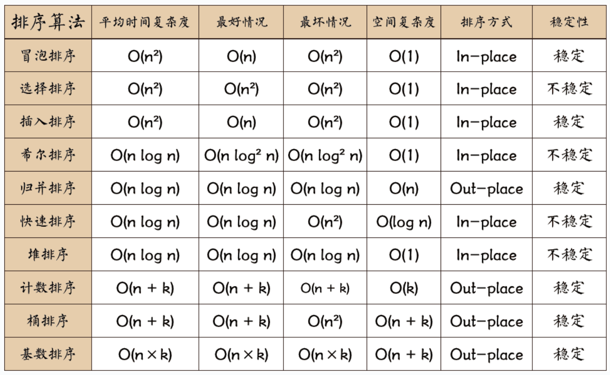
#### 1. 快排代码
```cpp
void QuickSort(vector<int>& array, int low, int high) {
    int i = low; 
    int j = high;
    if(i >= j) {
        return;
    }
 
    int temp = array[low];
    while(i != j) {
        while(array[j] >= temp && i < j) {
            j--;
        }
	    while(array[i] <= temp && i < j) {
            i++;
        }
	    if(i < j) {
            swap(array[i], array[j]);
        }
    }
 
    //将基准temp放于自己的位置，（第i个位置）
    swap(array[low], array[i]);
    QuickSort(array, low, i - 1);
    QuickSort(array, i + 1, high);
}
```
#### 2. 归并排序代码
```cpp
#include <iostream>
#include <vector>

using namespace std;

// 合并函数：将两个已排序的子数组合并为一个已排序的数组
void merge(vector<int>& arr, int const left, int const mid, int const right) {
    auto const subArrayOne = mid - left + 1;
    auto const subArrayTwo = right - mid;

    // 创建临时数组
    auto *leftArray = new int[subArrayOne],
         *rightArray = new int[subArrayTwo];

    // 拷贝数据到临时数组
    for (auto i = 0; i < subArrayOne; i++)
        leftArray[i] = arr[left + i];
    for (auto j = 0; j < subArrayTwo; j++)
        rightArray[j] = arr[mid + 1 + j];

    auto indexOfSubArrayOne = 0,   // 初始化第一个子数组的索引
         indexOfSubArrayTwo = 0;   // 初始化第二个子数组的索引
    int indexOfMergedArray = left; // 初始化合并子数组的索引

    // 合并临时数组回到原数组中
    while (indexOfSubArrayOne < subArrayOne && indexOfSubArrayTwo < subArrayTwo) {
        if (leftArray[indexOfSubArrayOne] <= rightArray[indexOfSubArrayTwo]) {
            arr[indexOfMergedArray] = leftArray[indexOfSubArrayOne];
            indexOfSubArrayOne++;
        } else {
            arr[indexOfMergedArray] = rightArray[indexOfSubArrayTwo];
            indexOfSubArrayTwo++;
        }
        indexOfMergedArray++;
    }

    // 拷贝剩余元素，如果有的话
    while(indexOfSubArrayOne < subArrayOne) {
        arr[indexOfMergedArray] = leftArray[indexOfSubArrayOne];
        indexOfSubArrayOne++;
        indexOfMergedArray++;
    }

    while(indexOfSubArrayTwo < subArrayTwo) {
        arr[indexOfMergedArray] = rightArray[indexOfSubArrayTwo];
        indexOfSubArrayTwo++;
        indexOfMergedArray++;
    }

    delete[] leftArray;
    delete[] rightArray;
}

// 归并排序函数
void mergeSort(vector<int>& arr, int const begin, int const end) {
    if (begin >= end)
        return; // 递归返回条件

    auto mid = begin + (end - begin) / 2;
    mergeSort(arr, begin, mid);
    mergeSort(arr, mid + 1, end);
    merge(arr, begin, mid, end);
}

int main() {
    vector<int> arr = {12, 11, 13, 5, 6, 7};
    mergeSort(arr, 0, arr.size()-1);

    cout << "Sorted array: \n";
    for(auto const& value: arr){
        cout << value << " ";
    }
    cout << endl;

    return 0;
}
```
#### 3. 堆排序代码
```cpp
#include <iostream>
using namespace std;

// 交换函数
void swap(int &a, int &b) {
    int temp = a;
    a = b;
    b = temp;
}

// 维护堆的性质
void heapify(int arr[], int n, int i) {
    int largest = i; // 初始化最大的为根节点
    int left = 2 * i + 1; // 左孩子
    int right = 2 * i + 2; // 右孩子

    // 如果左孩子大于根节点
    if (left < n && arr[left] > arr[largest])
        largest = left;

    // 如果右孩子大于当前最大值
    if (right < n && arr[right] > arr[largest])
        largest = right;

    // 如果最大值不是根节点
    if (largest != i) {
        swap(arr[i], arr[largest]);
        // 递归地调整被影响的子树
        heapify(arr, n, largest);
    }
}

// 堆排序主函数
void heapSort(int arr[], int n) {
    // 构建最大堆
    for (int i = n / 2 - 1; i >= 0; i--)
        heapify(arr, n, i);

    // 一个个从堆中取出元素
    for (int i = n - 1; i >= 0; i--) {
        // 将当前根（最大值）移到数组末尾
        swap(arr[0], arr[i]);

        // 调整堆，使其保持最大堆的性质
        heapify(arr, i, 0);
    }
}

// 打印数组
void printArray(int arr[], int n) {
    for (int i = 0; i < n; ++i)
        cout << arr[i] << " ";
    cout << "\n";
}

int main() {
    int arr[] = {12, 11, 13, 5, 6, 7};
    int n = sizeof(arr)/sizeof(arr[0]);

    heapSort(arr, n);

    cout << "Sorted array is \n";
    printArray(arr, n);
}
```

### 2. 0-1背包
```c
dp[i][w] = max(dp[i-1][w], dp[i-1][w-weight[i-1]] + value[i-1])
dp[w] = max(dp[w], dp[w - weights[i]] + values[i])
```

### 3. 解决hash冲突

**1. 链地址法（Separate Chaining）**
- 每个哈希桶存储一个链表（或vector，红黑树等其他数据结构），当发生冲突时，将冲突的元素添加到链表中。

**2. 开放地址法（Open Addressing）**
- 当发生冲突时，通过某种探测算法（如线性探测、二次探测或双重哈希）寻找下一个可用的空桶。

**3. 再哈希法（Rehashing）**
- 当哈希表的负载因子超过一定阈值时，创建一个新的更大的哈希表，并将所有元素重新插入到新的表中。


| 方法               | 优点                                      | 缺点                                     |
|--------------------|-------------------------------------------|------------------------------------------|
| **链地址法**       | 简单、易于实现；适合动态扩展             | 需要额外内存；链表过长时性能下降         |
| **开放地址法**     | 缓存友好；节省内存                       | 易受聚集影响；删除操作复杂               |
| **再哈希法**       | 动态调整大小，减少冲突                   | 扩容代价高                               |

### 4. 线程安全
//TODO 

### 5. 堆栈型替换算法
堆栈型替换算法（Stack-based Replacement Algorithm）通常指的是在计算机系统的存储管理中，特别是缓存（Cache）或虚拟内存管理时使用的一种页面替换策略。这种算法基于程序的局部性原理，即程序倾向于访问相对较小的地址集一段时间，之后会转移到其他地址集。例：LRU（最近最少使用）和LFU（最少使用）算法都是堆栈型替换算法的变种。

### 6. TCP/UDP

#### 为什么要进行三次握手而不是两次
1. **第一次握手**：客户端向服务器发送一个SYN（同步序列编号，Synchronize Sequence Numbers）包，表示希望与服务器建立连接。
   
2. **第二次握手**：服务器接收到客户端的SYN包后，会回复一个ACK（确认字符，Acknowledgement），同时也会发送自己的SYN包给客户端，这通常被称作SYN-ACK包。这个步骤有两个目的：一是对客户端的SYN包进行确认，二是服务器也提出了希望与客户端建立连接的请求。

3. **第三次握手**：客户端收到服务器的SYN-ACK包后，会对服务器的SYN进行确认，发送一个ACK包回服务器。这样，双方都确认了彼此的发送和接收能力正常，从而可以开始进行数据传输。

**如果只使用两次握手，虽然能够保证双方知道对方的存在并且可以接收信息，但无法保证双方都能够发送信息**。例如，在某些情况下，客户端可能能够接收来自服务器的信息，但它自身可能无法发送信息。这种情况会导致只有单向通信，而TCP连接要求的是双向通信。因此，**三次握手确保了双方都可以发送和接收数据**，这是实现可靠通信的关键。
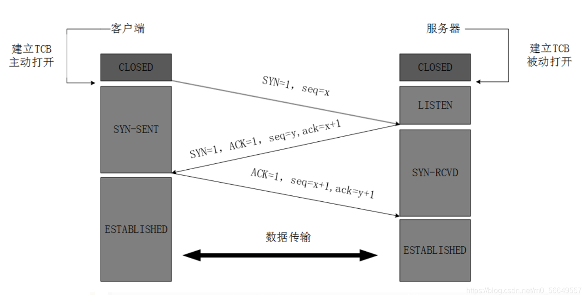


#### 怎么保证UDP的可靠传输
**无连接**: UDP不需要建立连接就可以发送数据，这使得它具有低延迟的优势。
**不保证可靠性**: UDP不提供数据包的确认机制，因此无法确保数据包的到达、顺序和完整性。
**不保证顺序**: UDP数据包可能会以不同的顺序到达接收方，接收方无法依赖UDP协议来重组这些数据包。
**没有流量控制**: UDP不提供流量控制机制，这意味着发送方可能会以超出接收方处理能力的速度发送数据。

①超时重传（定时器）

②有序接受 （添加包序号）将数据包进行编号，按照包的顺序接收并存储。

③应答确认 （Seq/Ack应答机制）

④滑动窗口流量控制等机制 （滑动窗口协议）

RUDP
TCP属于是通过增大延迟和传输成本来保证质量的通信方式，UDP是通过牺牲质量来保证时延和成本的通信方式，RUDP就是在这两者中找到一个平衡点。
RUDP 提供一组数据服务质量增强机制，如拥塞控制的改进、重发机制及淡化服务器算法等，从而在包丢失和网络拥塞的情况下， RTP 客户机（实时位置）面前呈现的就是一个高质量的 RTP 流。在不干扰协议的实时特性的同时，可靠 UDP 的拥塞控制机制允许 TCP 方式下的流控制行为。

RTP
实时传输协议（RTP）为数据提供了具有实时特征的端对端传送服务，如在组播或单播网络服务下的交互式视频音频或模拟数据。应用程序通常在 UDP 上运行 RTP 以便使用其多路结点和校验服务；这两种协议都提供了传输层协议的功能。但是 RTP 可以与其它适合的底层网络或传输协议一起使用。如果底层网络提供组播方式，那么 RTP 可以使用该组播表传输数据到多个目的地。

RTP 本身并没有提供按时发送机制或其它服务质量（QoS）保证，它依赖于底层服务去实现这一过程。 RTP 并不保证传送或防止无序传送，也不确定底层网络的可靠性。 RTP 实行有序传送， RTP 中的序列号允许接收方重组发送方的包序列，同时序列号也能用于决定适当的包位置，例如：在视频解码中，就不需要顺序解码。

UDT
基于UDP的数据传输协议（UDP-basedData Transfer Protocol，简称UDT）是一种互联网数据传输协议。UDT的主要目的是支持高速广域网上的海量数据传输，而互联网上的标准数据传输协议TCP在高带宽长距离网络上性能很差。顾名思义，UDT建于UDP之上，并引入新的拥塞控制和数据可靠性控制机制。UDT是面向连接的双向的应用层协议。它同时支持可靠的数据流传输和部分可靠的数据报传输。由于UDT完全在UDP上实现，它也可以应用在除了高速数据传输之外的其它应用领域，例如点到点技术（P2P），防火墙穿透，多媒体数据传输等等。

### 7. 内存布局

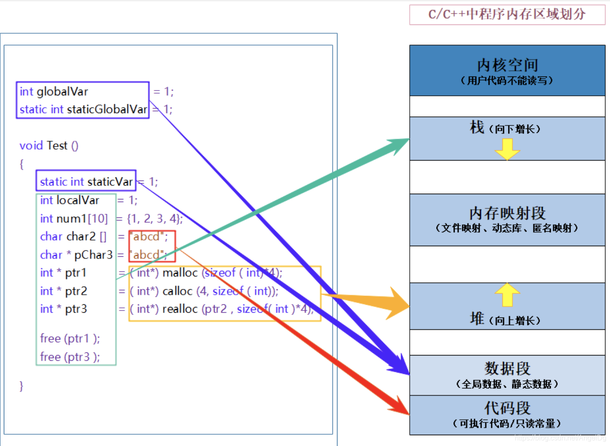
- 内核空间： 放置操作系统相关的代码和数据。（用户不能直接进行操作 ------ 可以通过调用系统提供的 api 函数）

- 栈又叫堆栈，非静态局部变量/函数参数/返回值等等，栈是向下增长的。

- 内存映射段是高效的I/O映射方式，用于装载一个共享的 动态内存库。用户可使用系统接口创建共享共享内存，做进程间通信。

- 堆用于程序运行时动态内存分配，堆是可以上增长的。

- 数据段–存储全局数据和静态数据。

- 代码段–可执行的代码/只读常量。

### 8. 线程和进程的区别


#### 进程（Process）

- **定义**：进程是操作系统进行资源分配和调度的基本单位，它是程序执行的一个实例。
- **资源独立性**：每个进程都有独立的地址空间、文件描述符、安全上下文等资源。一个进程中的数据通常对另一个进程不可见。

#### 线程（Thread）

- **定义**：线程是进程内的基本执行单位，是操作系统能够进行运算调度的最小单位。一个进程可以包含多个线程，所有线程共享该进程的资源。


| 特性           | 进程                               | 线程                               |
|----------------|------------------------------------|------------------------------------|
| 资源分配       | 独立的资源分配                     | 共享所属进程的资源                |
| 地址空间       | 每个进程有独立的地址空间           | 同一进程的线程共享地址空间        |
| 通信方式       | 需要专门的IPC机制                  | 直接通信，但需处理同步问题        |
| 开销           | 较大，包括上下文切换和资源管理     | 较小，主要在栈和寄存器状态间切换  |
| 安全与隔离性   | 强隔离性，一个进程崩溃不影响其他    | 若一个线程出错可能影响整个进程    |
| 创建与销毁     | 成本较高                           | 成本较低                          |

选择使用进程还是线程取决于具体的应用需求。对于需要高度隔离性的任务，或不同任务间不需要频繁交互的情况，使用多进程模型更为合适；而对于那些需要快速切换、高效的数据共享的任务，则更适合采用多线程模型。

#### 进程间通信（IPC）

进程间通信是指运行在不同地址空间的进程之间进行数据交换的方式。由于每个进程都有自己独立的地址空间，因此需要专门的机制来实现通信。

1. **管道（Pipe）**
   - 包括匿名管道和命名管道（FIFO）。匿名管道主要用于具有亲缘关系的进程间通信（如父子进程），而命名管道可以在不相关的进程之间使用。
   
2. **消息队列（Message Queue）**
   - 允许进程通过发送和接收消息来进行通信，是一种异步通信机制。
   
3. **信号量（Semaphore）**
   - 用于控制多个进程对共享资源的访问，确保数据的一致性和完整性。
   
4. **共享内存（Shared Memory）**
   - 多个进程可以同时访问同一块内存区域，是最高效的IPC形式之一。通常与信号量结合使用以管理对共享内存的访问。
   
5. **套接字（Socket）**
   - 支持不同机器上的进程间通信，也可用于本地进程间通信。广泛应用于网络编程中。
   
6. **信号（Signal）**
   - 一种比较原始的通信方式，用于通知接收进程某个事件已经发生。

#### 线程间通信

线程通信指的是同一个进程内的线程之间的通信。因为线程共享所属进程的资源和地址空间，所以线程间的通信相对简单但也更需注意同步问题。

1. **互斥锁（Mutex）**
   - 用来保护共享资源免受并发访问的影响，确保任意时刻只有一个线程能够访问该资源。
   
2. **条件变量（Condition Variable）**
   - 允许线程等待某些条件的发生，并在线程间传递状态变化的通知。
   
3. **读写锁（Read-Write Locks）**
   - 提供了一种比互斥锁更灵活的加锁机制，允许多个读线程同时访问资源，但写线程独占访问。
   
4. **原子操作（Atomic Operations）**
   - 对于一些简单的同步需求，可以直接使用原子操作来避免竞态条件，比如增加计数器等。
   
5. **屏障（Barrier）**
   - 让一组线程到达一个同步点后继续执行，所有线程必须等到最后一个线程到达屏障后才能继续运行。

### 9. 红黑树，AVL树，Hashmap比较

#### 红黑树
**红黑树的性质**

- 每个节点要么是红色，要么是黑色。
- 根节点是黑色。
- 所有的叶子节点（通常用NIL或NULL表示）都是黑色的。
- 如果一个节点是红色，则它的两个子节点都是黑色（即不能有两个连续的红色节点）。
- 从任一节点到其每个叶子的所有路径都包含相同数量的黑色节点。

这些规则确保了从根到叶子的最长路径不会超过最短路径的两倍，从而保证了树的高度是对数级别的。

#### 红黑树与平衡二叉树的比较
1、红黑树放弃了追求完全平衡，追求大致平衡，在与平衡二叉树的时间复杂度相差不大的情况下，保证每次插入最多只需要三次旋转就能达到平衡，实现起来也更为简单。

2、平衡二叉树追求绝对平衡，条件比较苛刻，实现起来比较麻烦，每次插入新节点之后需要旋转的次数不能预知。

#### 红黑树和哈希表的比较

权衡三个因素: 查找速度, 数据量, 内存使用，可扩展性，有序性。

- hash查找速度会比红黑树树快，而且查找速度基本和数据量大小无关，属于常数级别;
- 而RB树的查找速度是log(n)级别。并不一定常数就比log(n) 小，因为hash还有hash函数的耗时。当元素达到一定数量级时，考虑hash。
- 但若你对内存使用特别严格， 希望程序尽可能少消耗内存，那么hash可能会让你陷入尴尬，特别是当你的hash对象特别多时，你就更无法控制了，而且 hash的构造速度较慢。
- 红黑树是有序的，Hash是无序的，根据需求来选择。
- 红黑树占用的内存更小（仅需要为其存在的节点分配内存），而Hash事先应该分配足够的内存存储散列表,即使有些槽可能弃用
- 红黑树查找和删除的时间复杂度都是O(logn)，Hash查找和删除的时间复杂度都是O(1)。


## 3. Leetcode算法大类

### 1. Fisher-Yates 洗牌算法 给定的数组乱序
 各列含义：范围、当前数组随机交换的位置、剩余没有被选择的数、已经随机排列的数
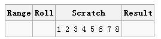

第一轮：从1到8中随机选择一个数，得到6，则交换当前数组中第8和第6个数
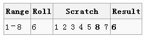

第二论：从1到7中随机选择一个数，得到2，则交换当前数组中第7和第2个数
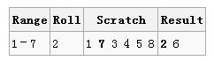

下一个随机数从1到6中摇出，刚好是6，这意味着只需把当前线性表中的第6个数留在原位置，接着进行下一步；以此类推，直到整个排列完成。
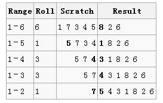

截至目前，所有需要的置乱已经完成，所以最终的结果是：7 5 4 3 1 8 2 6

### 2. Leetcode53 最大子数列之和
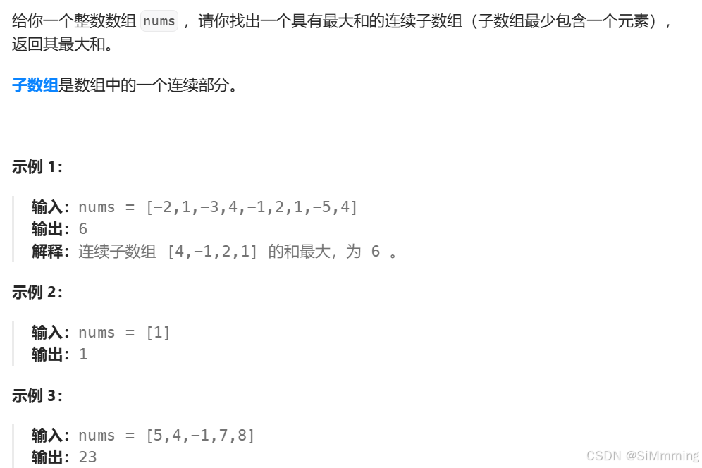
如果已知 Q(list, i - 1)， 我们可以将问题分为两种情况，即以索引为 i 的元素终止，
或者只有一个索引为 i 的元素。

如果以索引为 i 的元素终止， 那么就是 Q(list, i - 1) + list[i]
如果只有一个索引为 i 的元素，那么就是 list[i]
分析到这里，递推关系就很明朗了，即
```
Q(list, i) = Math.max(0, Q(list, i - 1)) + list[i]
```
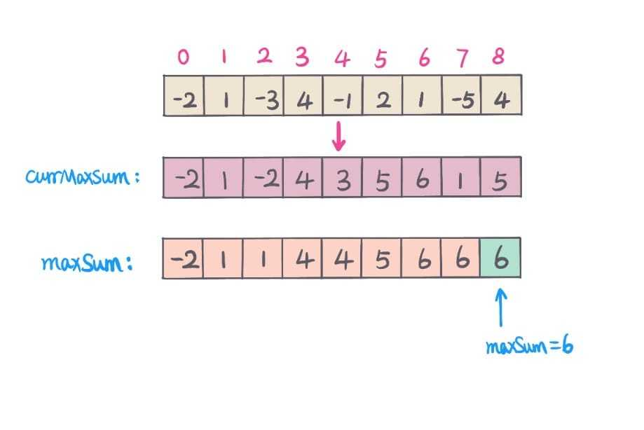

### 3. 滑动窗口类型
```c++
//外层循环扩展右边界，内层循环扩展左边界
for (int l = 0, r = 0 ; r < n ; r++) {
	//当前考虑的元素
	while (l <= r && check()) {//区间[left,right]不符合题意
        //扩展左边界
    }
    //区间[left,right]符合题意，统计相关信息
}
```

### 4. 下一个更大排列
```cpp
int nextGreaterPermutation(int N) {
    string s = to_string(N);
    int n = s.size();

    // Step 1: 找到第一个可以交换的位置 i
    int i = n - 2;
    while (i >= 0 && s[i] >= s[i + 1]) {
        i--;
    }

    if (i == -1) {
        return -1; // 没有更大的排列
    }

    // Step 2: 找到 j > i 且 s[j] > s[i] 中最小的那个
    int j = n - 1;
    while (s[j] <= s[i]) {
        j--;
    }

    // Step 3: 交换
    swap(s[i], s[j]);

    // Step 4: 反转 i+1 到结尾
    reverse(s.begin() + i + 1, s.end());

    // 转换回整数并返回
    return stoi(s);
}
```

## 4. 图形学大类

### 1. 图形渲染管线
图形渲染管线实际上指的是一堆原始图形数据途经一个输送管道，期间经过各种变化处理最终出现在屏幕的过程，在概念上可以将图形渲染管线分为四个阶段：应用程序阶段（CPU）、几何阶段（GPU）、光栅化阶段（GPU）和像素处理阶段（GPU）。
（1）应用程序阶段的主要任务，是识别出潜在可视的网格实例，并把它们及其材质呈交至图形硬件以供渲染。该阶段包含三大任务：可见性判断、控制着色器参数和渲染状态、提交图元至GPU硬件以供渲染。

（2）几何阶段主要负责大部分多边形操作和顶点操作，将三维空间的数据转换为二维空间的数据，可以分为顶点着色、投影变换、裁剪和屏幕映射阶段。

（3）光栅化阶段是将图元离散化成片段的过程，其任务是找到需要绘制出的所有片段，包括三角形设定(图元装配)和三角形遍历阶段；

（4）像素处理阶段，给每一个像素正确配色，最后绘制出整幅图像，包括像素着色和合并阶段。

### 2. MVP变换
在计算机图形学中，MVP 分别代表模型（Model）、视图（View）和投影（Projection）变换矩阵。这三种变换是将三维世界中的物体转换到二维屏幕空间的关键步骤。下面是对每个部分的简要总结：

##### 1. 模型变换（Model Transformation）

- **定义**：模型变换用于将物体从其局部坐标系（也称为对象空间或模型空间）转换到世界坐标系（世界空间）。
- **用途**：允许我们将物体放置在虚拟世界中的任意位置，并且可以对其进行旋转、缩放等操作。
- **矩阵表示**：通过一个4x4的矩阵来实现这些变换，该矩阵包含了平移、旋转和缩放信息。

#### 2. 视图变换（View Transformation）

- **定义**：视图变换又称为摄像机变换，它负责将场景从世界坐标系转换到观察者（或摄像机）的视角坐标系。
- **用途**：模拟不同视角下的观察效果，就像我们在现实生活中移动头部或者改变相机的位置一样。
- **矩阵表示**：通常使用一个4x4的视图矩阵来表示这种变换。为了简化计算，我们经常采用将世界移动到摄像机位置的方法，而不是直接移动摄像机本身。

#### 3. 投影变换（Projection Transformation）

- **定义**：投影变换将经过模型和视图变换后的三维坐标转换为二维图像坐标，即最终显示在屏幕上的图像。
- **类型**：
  - **正交投影（Orthographic Projection）**：不考虑远近关系，适用于建筑图纸等需要精确比例的应用场景。
  - **透视投影（Perspective Projection）**：更接近人类视觉体验，远处的物体会显得较小，适合大多数3D游戏和动画制作。
- **用途**：确定物体如何被投射到屏幕上，以及它们之间的相对大小和位置关系。
- **矩阵表示**：同样由一个4x4的矩阵完成，根据所选择的投影类型（正交或透视），矩阵的具体值会有所不同。

### 3. A*寻路算法
**A* 算法在Dijkstra算法的基础上引入了启发函数**
```c
f(n) = g(n) + h(n)
//f(n)是节点n的综合优先级。当我们选择下一个要遍历的节点时，我们总会选取综合优先级最高（值最小）的节点。

//g(n) 是*节点n*距离*起点*的代价。

//h(n)是*节点n*距离*终点*的预计代价，这也就是A*算法的启发函数。
```

**启发函数是对当前节点到目标节点所需代价的预估**，有助于提高搜索速度。相较于Dijkstra算法，A* 算法搜索最短路径的效率更高。

启发式函数一般使用曼哈顿距离、欧几里德距离。原理：从起点开始不断向目标点的方向遍历（常见的遍历方式分为八邻域、四邻域），并记录下每一个遍历点的父节点（找到目标点后回溯路径），反复循环，直到搜索到目标点后停止，再从目标点回溯起点，找到成本最小的路径。

优点：启发式函数能提高算法的运行效率，更快的找到最优路径。

缺点：地图尺寸过大或精度过高时，需要搜索的节点数量较多，搜索速度慢。

(1) 把起点加入 open list 。

(2) 重复如下过程：

a.         遍历 open list ，查找 F 值最小的节点，把它作为当前要处理的节点。

b.         把这个节点移到 close list 。

c.         对当前方格的 8 个相邻方格的每一个方格？            

- 如果它是不可抵达的或者它在 close list 中，忽略它。否则，做如下操作。

- 如果它不在 open list 中，把它加入 open list ，并且把当前方格设置为它的父亲，记录该方格的 F ， G 和 H 值。

- 如果它已经在 open list 中，检查这条路径 ( 即经由当前方格到达它那里 ) 是否更好，用 G 值作参考。更小的 G 值表示这是更好的路径。如果是这样，把它的父亲设置为当前方格，并重新计算它                                                                的 G 和 F 值。如果你的 open list 是按 F 值排序的话，改变后你可能需要重新排序。

d.         停止，当你

- 把终点加入到了 open list 中，此时路径已经找到了，或者

- 查找终点失败，并且 open list 是空的，此时没有路径。

(3) 保存路径。从终点开始，每个方格沿着父节点移动直至起点，这就是你的路径。

## 5. 客户端工具大类

## 6. 数据库后端大类

### 1. IO多路复用
#### 1. select
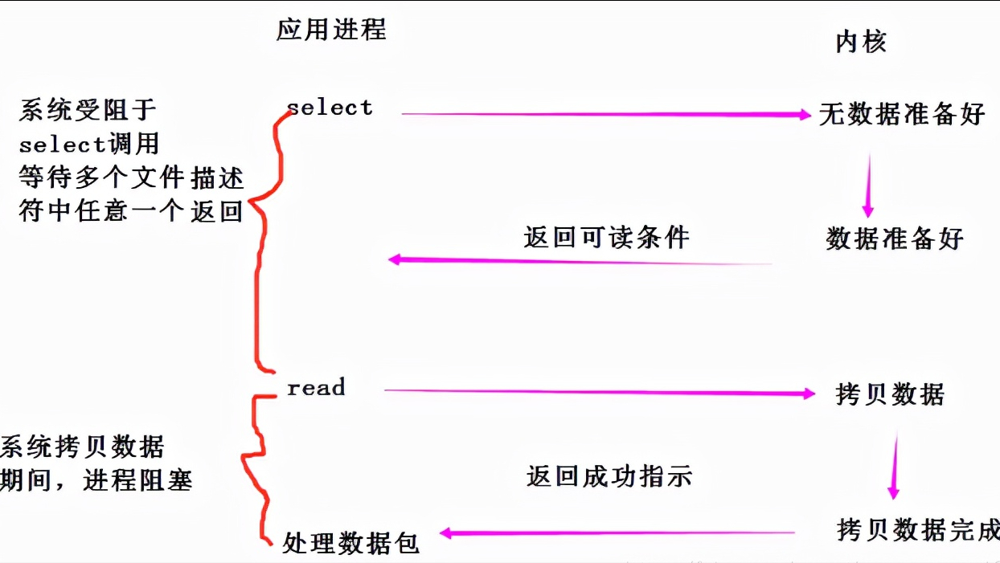
select 最多能同时监视 1024 个 socket（因为 fd_set 结构体大小是 128 字节，每个 bit 表示一个文件描述符）。用户需要维护一个临时数组，存储文件描述符。当内核有事件发生时，内核将 fd_set 中没发生的文件描述符清空，然后拷贝到用户区。select 返回的是整个数组，它需要遍历整个数组才知道谁发生了变化。
#### 2. poll
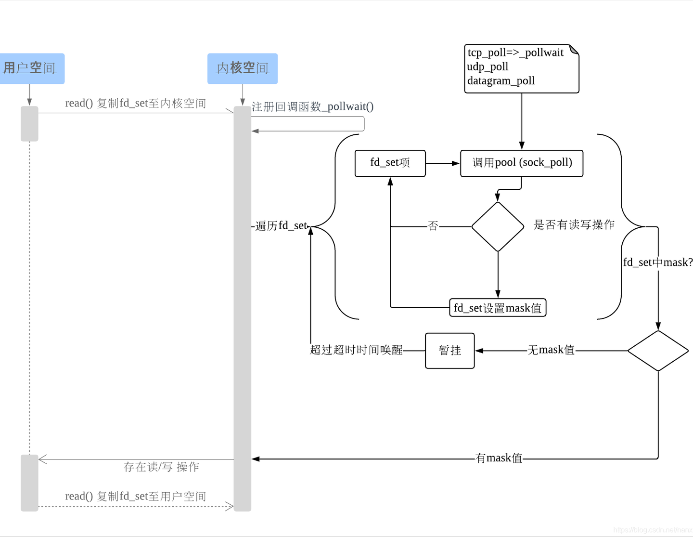
#### 3. epoll

- **epoll 是基于事件驱动的 IO 方式**，它没有文件描述符个数限制，它将用户关心的文件描述符的事件存放到内核的一个事件表中（简单来说，就是由内核来负责存储（红黑树）有事件的 socket 句柄），这样在用户空间和内核空间的copy只需一次。优点如下：

- 没有最大并发连接的限制，能打开的fd上限远大于1024（1G的内存能监听约10万个端口）
- 采用回调的方式，效率提升。只有活跃可用的fd才会调用callback函数，也就是说 epoll 只管你“活跃”的连接，而跟连接总数无关；
- 内存拷贝。使用mmap()文件映射内存来加速与内核空间的消息传递，减少复制开销。

**epoll 有两种工作方式**：

- LT模式（水平触发）：若就绪的事件一次没有处理完，就会一直去处理。也就是说，将没有处理完的事件继续放回到就绪队列之中（即那个内核中的链表），一直进行处理。
- ET模式（边缘触发）：就绪的事件只能处理一次，若没有处理完会在下次的其它事件就绪时再进行处理。而若以后再也没有就绪的事件，那么剩余的那部分数据也会随之而丢失。

由此可见：ET模式的效率比LT模式的效率要高很多。简单点说就是，如果对于一个非阻塞 socket，如果使用 epoll 边缘模式去检测数据是否可读，触发可读事件以后，一定要一次性把 socket 上的数据收取干净才行，也就是说一定要循环调用 recv 函数直到 recv 出错，错误码是EWOULDBLOCK（EAGAIN 一样）（此时表示 socket 上本次数据已经读完）；如果使用水平模式，则不用，你可以根据业务一次性收取固定的字节数，或者收完为止。只是如果使用ET模式，就要保证每次进行数据处理时，要将其处理完，不能造成数据丢失，这样对编写代码的人要求就比较高。

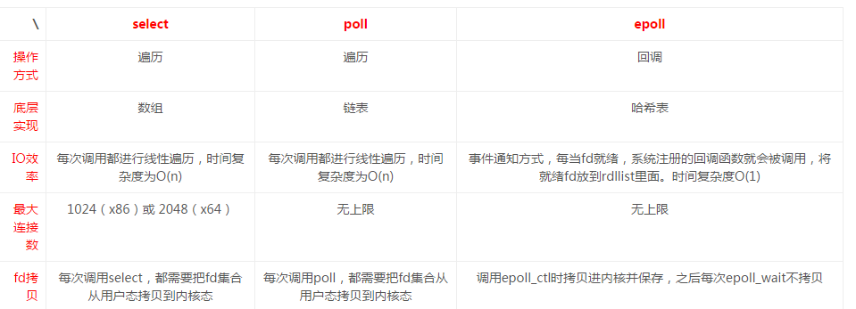

### 2. libevent
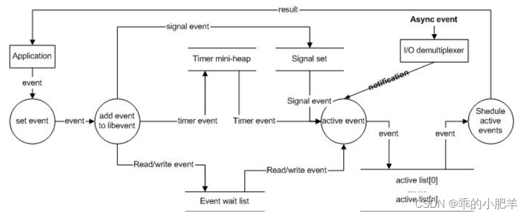
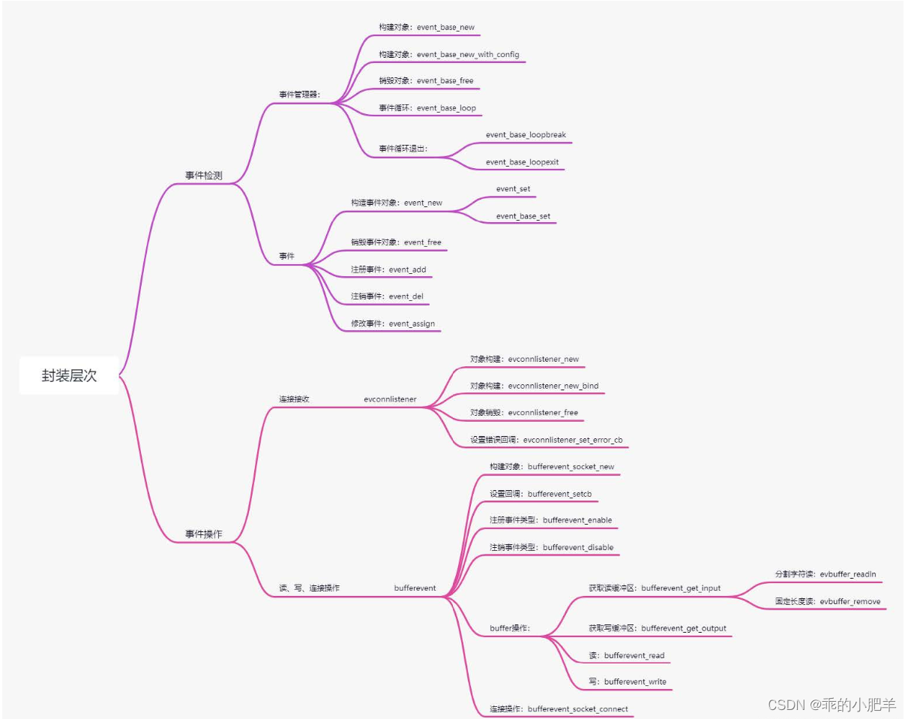
## 7. 其他大类

### 1. 处理循环依赖的核心思想是解耦，可以通过以下方式实现：

使用接口或抽象类。
延迟加载（Lazy Loading）（工厂方法或使用时创建）。
引入事件驱动模型（利用消息传递）。
重构设计，提取公共逻辑。

### 2. 遇到的最难解决的事
我开发的是装备系统的批量装备分解功能优化，客户端需要在分解之前展示要分解的产物。这时就需要获取到要分解的装备的装备队列和对应的分解产物的队列。比较麻烦的一点是分解产物队列不能有重复。而且在装备队列发生变化时要能及时改变分解队列的展示。
为了实现这个功能，我使用了两个数组分别存储与装备队列相关的分解队列 和 展示到界面上的产物队列。首先在获取到装备队列时我使用map<int, vector<int>>来存储格子控件的编号以及控件上要装备所对应的分解产物数组。然后遍历装备数组，得到了一个有重复的分解产物队列m_vec1， 然后在使用set<int>进行去重得到最终的展示队列。在增减装备的时候就需要通过find key找到对应的控件号，在去除这个控件上的装备，然后delete掉这个map对象。然后就完成了这个功能的基础实现。
在这个案例中，因为是在原代码的基础上优化，就没有改动服务端的逻辑，而是使用了一个装备分解表来实现了客户端的逻辑，虽然这样在空间上有一定的冗余，但是在时间上由于不需要与服务端进行通信，还是较好的提高了游戏的连续性和用户的体验。

### 3. json, xml 和 protobuf 的对比


| **特性**                | **XML**                                     | **JSON**                                    | **Protobuf**                                |
|-------------------------|---------------------------------------------|---------------------------------------------|---------------------------------------------|
| **全称**               | 可扩展标记语言 (eXtensible Markup Language) | JavaScript 对象表示法 (JavaScript Object Notation) | 协议缓冲区 (Protocol Buffers)              |
| **设计目标**           | 数据存储与传输                              | 轻量级数据交换格式                          | 高效的序列化与反序列化                     |
| **可读性**             | 人类可读性强                                | 人类可读性强                                | 人类难以直接阅读                            |
| **体积大小**           | 较大（标签冗余）                            | 较小                                       | 最小（二进制格式）                         |
| **解析速度**           | 慢                                         | 快                                         | 极快                                       |
| **支持复杂结构**       | 支持非常复杂的嵌套结构                      | 支持中等复杂度的嵌套结构                    | 支持复杂结构，但需定义.proto文件            |
| **语言支持**           | 广泛支持                                    | 广泛支持                                    | 多语言支持（需生成代码）                    |
| **扩展性**             | 高（自定义标签灵活）                        | 中（通过对象和数组扩展）                    | 高（需重新定义.proto文件）                  |
| **跨平台兼容性**       | 高                                         | 高                                         | 高                                         |
| **主要用途**           | 配置文件、文档存储、数据交换                | Web API、配置文件、数据交换                 | 高性能通信协议、大数据传输                 |
| **数据类型支持**       | 不直接支持特定数据类型                      | 支持基本数据类型（字符串、数字、布尔值等）  | 支持丰富的数据类型（需预定义）              |
| **是否需要定义结构**   | 否                                          | 否                                          | 是（需要.proto文件定义数据结构）            |
| **示例**               | `<person><name>John</name><age>30</age></person>` | `{"name": "John", "age": 30}`              | 定义 `.proto` 文件后序列化为二进制数据      |


**总结**
- **XML**: 适合需要复杂结构和高可读性的场景，例如配置文件或文档存储。
- **JSON**: 轻量且易用，适合 Web 应用和 API 数据交互。
- **Protobuf**: 高效紧凑，适合高性能需求的应用场景（如分布式系统、大数据传输）。

## 8. C#

### 1. 值类型和引用类型
值类型：包含了所有简单类型（整数、浮点、bool、char）、struct、enum。
继承自System.ValueType

引用类型：string，object，class，interface，delegate，array
继承自System.Object

### 2. 拆箱装箱

装箱是将值类型转换为引用类型

拆箱：是将引用类型转换为值类型。
牵扯到装箱和拆箱操作比较多的就是在集合中，例如：ArrayList或者HashTable之类。

装箱：值类型====》引用类型object

分配内存堆
值类型数据拷贝到新的内存堆中，栈中分配一个新的引用地址指向内存堆
拆箱：引用类型object====》值类型

检查确保对象是给定值类型的一个装箱值
将该值数据复制到栈中的值类型

### 3. 协程

#### 协程与线程的区别？

线程和进程都是同步机制，而协程是异步机制。

线程是抢占式，而协程是非抢占式的。需要用户释放使用权切换到其他协程，因此同一时间其实只有一个协程拥有运行权，相当于单线程的能力。

一个线程可以有多个协程，一个进程也可以有多个协程。

协程不被操作系统内核管理，而完全是由程序控制。线程是被分割的CPU资源，协程是组织好的代码流程，线程是协程的资源。但协程不会直接使用线程，协程直接利用的是执行器关联任意线程或线程池。

协程能保留上一次调用时的状态。

#### 协程的使用
yield return null; 暂停协程等待下一帧继续执行

yield return 0或其他数字; 暂停协程等待下一帧继续执行

yield return new WairForSeconds(时间); 等待规定时间后继续执行

yield return StartCoroutine("协程方法名");开启一个协程（嵌套协程）

### 4. unity生命周期
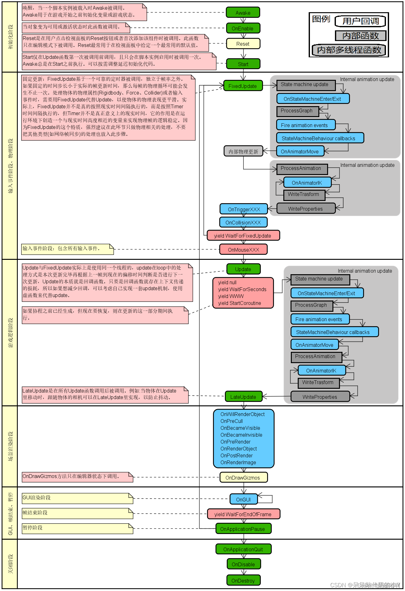
答：Awake —> OnEnable —> Start —> FixedUpdate —>Update —> LateUpdate—> OnGUl —> OnDisable —> OnDestroy

主要执行顺序

编辑器->初始化->物理系统->输入事件->游戏逻辑->场景渲染->GUI渲染->物体激活或禁用->销毁物体->应用结束
```

*Awake* 用于在游戏开始之前初始化变量或游戏状态。在脚本整个生命周期内它仅被调用一次，当脚本设置为不可用时，运行时Awake方法仍然会执行一次。Awake在所有对象被初始化之后调用，所以你可以安全的与其他对象对话或用诸如 GameObject.FindWithTag 这样的函数搜索它们。每个游戏物体上的Awke以随机的顺序被调用。因此，你应该用Awake来设置脚本间的引用，并用Start来传递信息 ,Awake总是在Start之前被调用。它不能用来执行协同程序。

*OnEnable*当对象变为可用或激活状态时被调用事件监听。

*Reset* 是在用户点击检视面板的Reset按钮或者首次添加该组件时被调用。此函数只在编辑模式下被调用。Reset最常用于在检视面板中给定一个最常用的默认值。

*Start* 在behaviour的生命周期中只被调用一次。它和Awake的不同是Start只在脚本实例被启用时调用。你可以按需调整延迟初始化代码。Awake总是在Start之前执行。这允许你协调初始化顺序。

*FixedUpdate* 当MonoBehaviour启用时，其在每一帧被调用。处理Rigidbody时，需要用FixedUpdate代替Update。例如:给刚体加一个作用力时，你必须应用作用力在FixedUpdate里的固定帧，而不是Update中的帧。(两者帧长不同)。

*Update* 是实现各种游戏行为最常用的函数。

*LateUpdate* 每帧调用一次（在 在所有Update函数调用后被调用） 用于更新游戏场景和状态，和摄像机相关的更新。 官网上例子是摄像机的跟随，都是所有的Update操作完才进行摄像机的跟进，不然就有可能出现摄像机已经推进了，但是视角里还未有角色的空帧出现。

*OnGUI* 渲染和处理GUI事件时调用。这意味着你的OnGUI程序将会在每一帧被调用。要得到更多的GUI事件的信息查阅Event手册。如果Monobehaviour的enabled属性设为false，OnGUI()将不会被调用。

*OnDisable* 不能用于协同程序。当对象变为不可用或非激活状态时此函数被调用。

*OnDestroy* 当对象被销毁时调用。

*OnApplicationQuit* 当用户停止运行模式时在编辑器中调用。当web被关闭时在网络播放器中被调用。
```
### 5. 泛型

## 9.项目问题

### 1. 游戏服务器

#### 1. TCP粘包
在基于TCP协议的网络通信中，由于TCP是面向字节流的协议，数据会被视为连续的字节序列传输。发送方和接收方之间的缓冲机制可能会导致粘包问题（Packet Gluing）或拆包问题（Packet Splitting）。具体表现为：

粘包：多个数据包被合并成一个数据包接收。

拆包：一个完整的数据包被拆分成多个部分接收。
这是因为TCP本身没有消息边界的概念，接收方无法直接区分消息的起始和结束位置。

*解决方案*：使用消息头指定消息长度
原理：在每条消息前附加一个固定长度的消息头，消息头中包含后续消息体的实际长度。

优点：高效，避免了固定长度消息的空间浪费。
可以动态处理不同长度的消息。

缺点：实现稍复杂，需要解析消息头。
需要确保消息头的长度是固定的。

#### 2. AOI(Area of Interest)
AOI（Area of Interest，兴趣区域）算法通常用于网络游戏、地理信息系统（GIS）、以及需要处理大量对象之间空间关系的应用中。
其主要目的是高效地检测和管理在特定区域内发生的事件或对象间的相互作用。例如，在大型多人在线游戏中，AOI算法可以用来确定哪些玩家角色在另一个玩家角色的视野范围内，从而优化网络传输的数据量。

*解决方案*：
网格划分法（Grid-based AOI）是一种简单且高效的AOI算法，特别适合处理空间分布均匀的对象。它通过将整个地图划分为固定大小的网格单元，每个对象分配到其所在的网格中，从而快速确定某个区域内的对象。

**1. 网格划分的基本原理**
- 将地图划分为固定大小的二维网格，每个网格用唯一标识符（如坐标 `(grid_x, grid_y)`）表示。
- 每个对象根据其位置被分配到对应的网格中。
- 查询时，只需检查目标对象所在网格及其相邻网格中的对象即可，无需遍历所有对象。


**(1) 初始化网格**
- 根据地图大小和网格尺寸，计算网格的数量。
- 使用一个二维数组或哈希表存储每个网格中的对象集合。

**(2) 对象分配**
- 根据对象的位置，将其分配到对应的网格中。
- 如果对象移动，则从原来的网格移除，并重新分配到新的网格。

**(3) 查询兴趣区域**
- 找到目标对象所在的网格。
- 遍历该网格及其相邻网格中的对象，判断是否在兴趣范围内。

**复杂度分析**
- **添加/移除对象**：O(1)，因为直接根据位置计算网格索引。
- **更新对象位置**：O(1)，只需移除旧位置并添加到新位置。
- **查询兴趣区域**：O(n)，其中 `n` 是目标网格及其相邻网格中的对象总数。由于网格划分限制了搜索范围，通常比全局搜索效率高得多。


